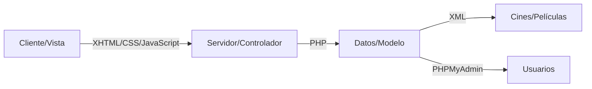

# CineSAR
**CineSAR** es una aplicación de consulta de información sobre películas en general y sobre los cines que hay en Donosti. Esta aplicación fue planteada como una práctica de una asignatura de Ingeniería Informática llamada Servicios y Aplicaciones en Red.  

  
Esta práctica parte de la motivación de utilizar parte de las tecnologías de red que se habían visto en la asignatura, en concreto todas las de web y presentaba una temática libre, por lo que esta fue la que se eligió para conformar dicho proyecto.

## Presentación y utilización de la aplicación
La aplicación inicialmente presenta una página en la que se puede elegir el apartado del que se quiere ver información, presentando en un bloque a un lado la opción _Cines_ y a otro lado la opción _Películas_, en pro de elegir sobre que se quiere ver información.

Si clicamos en el apartado de _Cines_ esto nos mostrará una página en la que se podrán ver en orden los numerosos cines de San Sebastián, en cambio si clicamos en la opción contigua _Películas_ esto nos mostrará una lista de películas.
Dentro de esa lista de películas si escogemos una nos llevará a una página específica con la información de la película, la cual contiene desde su sinopsis, reparto y portada hasta un trailer de la misma. En cada película se pueden escribir comentarios.

>Para poder escribir comentarios o añadir películas a la aplicación basta con registrarse en la página.

## Estructura de la aplicación
La estructura de la aplicación es sencilla y reúne en cierto modo el modelo-vista-controlador.  

## Instalación de la aplicación
Respecto a instalación de aplicación nos referimos de por sí a su soporte para su utilización, dada que es una aplicación web para poder ser utilizada necesitamos que esté entre otras cosas subida a un servicio de hosting, debido a que reúne las siguientes tecnologías implementadas:

* __XHTML__: Para lo que es el contenido estático de las páginas.
* __PHP__: Para todas las utilidades de lado servidor como el envío de datos o bien el contenido creado de forma dinámica en las páginas web.
*  __JavaScript__: Para el apartado de comprobaciones de los datos, así como animaciones o accesorios para dar estilo a las páginas.
* __JQuery__: Conforme a hacer más sencillo el uso de todo lo que incorpora JavaScript.
* __XML__: Para la obtención de datos sobre los _Cines_ o _Películas_.
* __PHPMyAdmin__: Para la base de datos de los usuarios de la aplicación.
*  __Apache__: Para dar soporte de hosting a la aplicación.

A continuación explicaremos su instalación de forma resumida en algunos pasos.

1. Como ya se ha explicado anteriormente, es necesario un servicio de hosting que nos permita utilizar todas las tecnologías comentadas. Para ello hay dos posibilidades:

    * Gestionar nuestro propio servicio de hosting (para internet y local).
    * Utilizar un servicio de hosting ya existente (para internet).

   Para esta instalación tomaremos en cuenta la primera forma debido a su comodidad, aunque el uso de servicios de hosting online puedan presentarse cómodos para este tipo de cosas (*véase la aplicación de hosting que reúne todas estas tecnologías [__000webhost__](https://www.000webhost.com/)*). Para este caso se puede utilizar la aplicación __WAMP__ para equipos que soporten Windows o bien su equivalente en Linux, __LAMP__.

   Estas aplicaciones soportarán todas las tecnologías comentadas anteriormente.

2. Una vez se tenga __WAMP__ o __LAMP__ instalada, el siguiente paso será desplegar en local la aplicación. Para ello basta con abrir la carpeta desde dónde se mostrará el contenido y dónde deberemos pegar todos los archivos de los que dispone este repositorio en GitHub. Este lugar dónde pegar los archivos se encuentra en una de las carpetas de la aplicación de hosting al que responde al directorio _`/var/www/html`_. Para ello se recomienda arrastar la carpeta que contenga todo el contenido de la aplicación.

3. Una vez lancemos todos los servicios de web y veamos que la página carga tanto los _Cines_ como las _Películas_. El siguiente paso será ingresar en `localhost` a **PhpMyAdmin**, ya que este se encargará de todo el apartado de usuarios. Para el despliegue de la base de datos bastará con cargar el fichero sql asociado al proyecto de forma que automáticamente se nos creé la base de datos y la aplicación la tenga asignada.

4. Probar la aplicación, después de seguir estos pasos, lo más probable es que no exista ya ningún error y se pueda utilizar la aplicación sin complicación alguna.

## Términos de uso
La licencia de está aplicación sostiene que es de libre uso. Sin embargo esta aplicación sigue la licencia de CC, Attribution-NonCommercial.  

## Contacto
En caso de notificar algún tipo de error con la aplicación, se puede contactar conmigo a raiz de mi cuenta [__GitHub__](https://github.com/FosterGun). 
